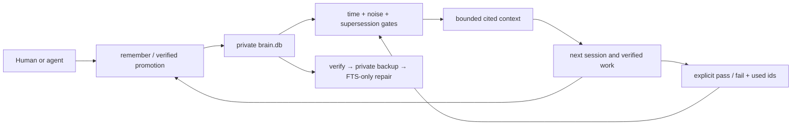

# Synapse Agent Memory


[](https://github.com/Supersynergy/synapse-agent-memory/actions/workflows/synapse-agent-memory-ci.yml)
[](https://github.com/Supersynergy/synapse-agent-memory/releases)
[](LICENSE-CORE.md)

> **Agents forget. The care, reasoning, and decisions behind your work should not.**

A project carries more than files. It carries the reason a choice was made, the
bug that already hurt once, the evidence that changed a plan, and the next step
someone should not have to reconstruct alone.

Synapse Agent Memory keeps that continuity in one private SQLite file and gives
the smallest useful, cited truth to the next coding-agent session.

One native Rust CLI. No Docker. No cloud account. No API key. No LLM in the
portable retrieval path.

## The 60-second answer

- **Remember deliberately:** decisions, facts, fixes, research, benchmarks, and
  recovery notes get types, dates, confidence, priority, and stable ids.
- **Return with context:** `context` and `prime` produce compact, cited briefs
  instead of replaying a transcript.
- **Keep truth current:** event time, explicit supersession, noise gates, and
  bounded priority stop old or loud records from posing as the answer.
- **Improve safely:** explicit pass/fail feedback calibrates retrieval; verified
  backup-before-repair self-heals only the rebuildable FTS index.

The portable release is deterministic and local-first. Semantic commands exist
for richer builds, but this download never pretends lexical retrieval is an
embedding model.

## Install

macOS or Linux:

```sh
curl -fsSL https://raw.githubusercontent.com/Supersynergy/synapse-agent-memory/main/release/synapse-agent-memory/install.sh | sh
```

Windows PowerShell:

```powershell
irm https://raw.githubusercontent.com/Supersynergy/synapse-agent-memory/main/release/synapse-agent-memory/install.ps1 | iex
```

The installer selects one of six native binaries, pins an exact release, checks
its SHA-256 sidecar, rejects unsafe archive contents, and runs `doctor`. Upgrade
preserves the previous binary; uninstall preserves your memory.

## First useful memory

```sh
BRAIN="$HOME/.synapse/brain.db"

synx -f "$BRAIN" init
synx -f "$BRAIN" remember --kind decision --priority critical \
  --occurred-at 2026-07-15 \
  "Run the release verifier before publishing."
synx -f "$BRAIN" context \
  "What must pass before the next release?" --mode coding
```

The output includes a `context_id`, source document ids, dates, scores, and the
exact feedback commands. Reward only evidence that genuinely helped:

```sh
synx -f "$BRAIN" feedback context:<context_id> <doc_id> \
  --gate pass --used <doc_id>

# The pack was not good enough:
synx -f "$BRAIN" feedback context:<context_id> --gate fail
```

Inside a repository, `synx -f "$BRAIN" prime .` builds the next session's startup
brief from Git state, source documents, commands, freshness evidence, and memory.

## Feature map

| Need | Commands and surface | What actually happens |
|---|---|---|
| Typed long-term memory | `remember`, `put` | Stores decisions, facts, fixes, research, ADRs, and notes with stable ids and provenance |
| Temporal truth | `--occurred-at`, date-aware `context` | Separates capture time from event time; understands ISO dates, English/German relative dates, months, and quarters |
| Truth replacement | `--supersedes <id>` | Keeps history but excludes the replaced answer from new context |
| Priority without distortion | `critical`, `high`, `normal`, `low` | Breaks close ranking ties; never lets unrelated content bypass relevance |
| Bounded cited context | `context --mode coding` | Applies a hard character budget and reports selected ids, dates, route, and filter counts |
| Local retrieval | `find`, `fallback`, `context` | Uses FTS5 lexical search with explicit hybrid/recent fallbacks and no hosted service |
| Repository continuity | `prime <repo>`, `ground` | Connects project state and related local knowledge to the task in front of the agent |
| Version freshness | `fresh-context --no-registry` | Reads manifests and lockfiles locally before cached package assumptions are trusted |
| Measured learning | `feedback`, `learn status` | Accepts explicit pack outcomes, rejects unseen ids, and calibrates scores and memory types locally |
| Safe self-healing | `doctor`, `doctor --fix`, `db-repair` | Verifies canonical SQLite and a restored private backup before repairing only FTS |
| Recovery and integrity | `backup`, `restore`, `snap`, `merge`, `db-verify` | Moves and checks memory with brainpacks, BLAKE3 integrity, rollback, and CRDT merge |
| Signatures | `keygen`, `sign`, `verify`, `snap-signed` | Adds Ed25519 authorship verification to selected records and packs |
| Data portability | `import`, `export`, `convert` | Supports CSV, TSV, JSON(L), SQLite, and brainpack flows without a database server |
| Knowledge structure | `graph`, `ground`, `corpus` | Provides local relationships, traversal, PageRank-style grounding, and a gated raw-corpus sidecar |
| Deliberate replication | `federate` | Synchronizes CRDT replicas over explicit peer connections rather than a central account |
| Disconnect recovery | optional Codex adapter | Stores minimal phase/checkpoint state without transcript text, command arguments, outputs, or file contents |

Exact included/excluded surface:
[release/synapse-agent-memory/FEATURES.md](release/synapse-agent-memory/FEATURES.md).

## The long-term truth loop



Four things stay separate:

1. **Captured at** — when the record entered memory.
2. **Occurred at** — when the event actually happened.
3. **Active truth** — the record that remains after explicit supersession.
4. **Usefulness** — evidence from context packs that really helped or failed.

This is practical self-optimization: measurable, local, bounded, and inspectable.
It is not autonomous code mutation, consciousness, or a claim of perfect recall.

## Self-healing without self-deception

`doctor --fix` does not rewrite memories to make a dashboard green. It:

1. refuses repair unless canonical SQLite passes `quick_check`;
2. creates a private brainpack and restores it into a temporary database;
3. verifies the restored backup and its hash;
4. rebuilds or optimizes only the derived FTS index;
5. checks row counts and SQLite again, then records a health event.

Documents and vectors remain untouched. An interrupted repair stays visible on
the next doctor run.

## What happened to Telepathy?

The historical Telepathy prototype tailed live transcript events. Its speed was
useful; letting status payloads and tool notifications drift into durable truth
was not.

The portable release keeps the good part through minimal Codex checkpoints, a
raw-corpus promotion gate, explicit typed memory, and context filters for known
`[telepathy]`, notification, stale, and archived records. Evidence is filtered,
not secretly deleted.

A future realtime transport must pass the same typing, provenance, noise, and
promotion gates. Realtime arrival is not permission to become memory.

## Private and fail-closed

- Memory lives in `~/.synapse/brain.db` unless you choose another path.
- Release archives contain no memory, checkpoints, transcripts, keys, or models.
- Missing or mismatched checksums stop installation.
- Archives with unexpected paths, links, or payload files are rejected.
- Every upgrade preserves `synx.previous`; uninstall keeps `brain.db`.
- The portable dependency closure is checked for advisories, policy, and licenses.
- All canonical release actions are pinned to immutable commit SHAs.

Threat boundary: [SECURITY.md](SECURITY.md).

## Portable release

| Platform | Architecture | Asset |
|---|---|---|
| macOS | Apple Silicon | `synapse-agent-memory-aarch64-apple-darwin.tar.gz` |
| macOS | Intel | `synapse-agent-memory-x86_64-apple-darwin.tar.gz` |
| Linux | x86-64 static musl | `synapse-agent-memory-x86_64-unknown-linux-musl.tar.gz` |
| Linux | ARM64 static musl | `synapse-agent-memory-aarch64-unknown-linux-musl.tar.gz` |
| Windows | x86-64 | `synapse-agent-memory-x86_64-pc-windows-msvc.zip` |
| Windows | ARM64 | `synapse-agent-memory-aarch64-pc-windows-msvc.zip` |

The release pipeline publishes only after all six native runners build, execute
the temporal memory/supersession smoke, package the archive, and verify checksums.

## Compatibility after the rename

The public name and repository are now **Synapse Agent Memory** at
`https://github.com/Supersynergy/synapse-agent-memory`.

The executable remains `synx`, the database remains `~/.synapse/brain.db`, and
`SYNAPSE_*` environment variables remain stable. Existing local memory, hooks,
scripts, and old GitHub links continue to work. The old installer path is a small
forwarder only; explicitly passing an old `synapse-memory-v*` tag still selects
its matching legacy archive. New documentation uses the canonical name everywhere.

## Deliberate boundary

The portable channel excludes the proprietary engine, daemon/MCP transport,
embedding model runtime, PDF parser, encrypted packs, sharding, Tantivy, and
unrelated database, market, multimodal, and benchmark experiments.

Without an embedding runtime, lexical retrieval, timeline fallback, cited
context, freshness, feedback, backup, graph basics, and merge still work.
Explicit vector operations fail clearly instead of pretending to be semantic.

## Build and verify from source

Rust 1.95 is pinned in `rust-toolchain.toml`.

```sh
TARGET="$(rustc -vV | sed -n 's/^host: //p')"
cargo build --locked --profile release-hardened \
  --target "$TARGET" -p synapse-cli --no-default-features

SYNX_BIN="target/$TARGET/release-hardened/synx" \
  release/synapse-agent-memory/verify.sh
```

Release details:
[portable README](release/synapse-agent-memory/README.md) ·
[proof](release/synapse-agent-memory/PROOF.md) ·
[gates](release/synapse-agent-memory/RELEASE-GATES.md) ·
[changelog](CHANGELOG.md)

## License and contributing

`synapse-core` uses FSL-1.1-ALv2 with an Apache-2.0 future grant. The portable CLI,
graph, and learning utility crates use MIT. The proprietary `synapse-engine` is
not part of the portable dependency graph or release archive.

See [LICENSE-CORE.md](LICENSE-CORE.md), [LICENSE](LICENSE),
[CONTRIBUTING.md](CONTRIBUTING.md), and [CODE_OF_CONDUCT.md](CODE_OF_CONDUCT.md).
