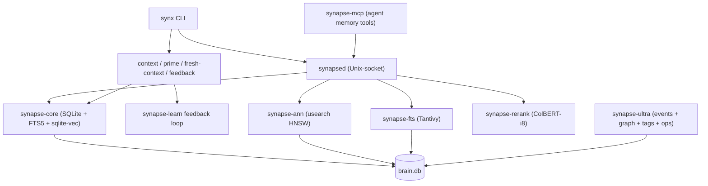

# Synapse Memory

[](https://github.com/Supersynergy/synapse-agent-memory/actions/workflows/ci.yml)
[](https://github.com/Supersynergy/synapse-agent-memory/actions/workflows/release-matrix.yml)
[](https://crates.io/crates/synapse-core)
[](LICENSE-CORE.md)
[](eval/)
[](#install)
[](#install)

**Local-first Context OS for AI agents. One SQLite file. No Docker. No cloud. Sub-ms vector search.**

Synapse Memory gives coding agents the best relevant context before they act — bounded, cited,
freshness-aware, and signed. It runs entirely on your machine, ships as a single binary,
and scales from a 5-line demo to a 294k-doc production brain.

> **Core promise:** best context, not biggest context.

---

## Why Synapse Memory

| | Synapse Memory | Mem0 | Letta (MemGPT) | Zep | Chroma | Qdrant |
|---|---|---|---|---|---|---|
| **Local-first, no Docker** | ✅ one binary | ❌ Python+Docker | ❌ Python+Docker | ❌ server | ⚠️ embedded | ❌ server |
| **SQLite-backed** | ✅ one file | ❌ Postgres/Neo4j | ❌ Postgres/SQLite | ❌ Postgres | ✅ | ❌ custom |
| **Hybrid search (FTS5 + ANN + RRF + rerank)** | ✅ sub-ms | ⚠️ basic | ❌ | ⚠️ basic | ⚠️ ANN only | ⚠️ ANN only |
| **Decision-chain graph (`why()`)** | ✅ recursive CTE | ❌ | ⚠️ messages | ❌ | ❌ | ❌ |
| **Ed25519 doc signing** | ✅ 25µs s+v | ❌ | ❌ | ❌ | ❌ | ❌ |
| **CRDT merge (offline sync)** | ✅ | ❌ | ❌ | ⚠️ | ❌ | ❌ |
| **MCP server (Claude/Cursor native)** | ✅ 6+ tools | ⚠️ | ⚠️ | ❌ | ❌ | ❌ |
| **Tag system + auto-rules** | ✅ | ⚠️ basic | ❌ | ⚠️ | ❌ | ❌ |
| **Prometheus + JSON metrics** | ✅ | ❌ | ❌ | ⚠️ | ❌ | ⚠️ |
| **zstd backup (64% compression)** | ✅ | ❌ | ❌ | ❌ | ❌ | ❌ |
| **LoCoMo + LongMemEval bench** | ✅ | ❌ | ❌ | ⚠️ | ❌ | ❌ |
| **6-native CI (linux/macos/windows × x64/arm64)** | ✅ | ❌ | ❌ | ❌ | ⚠️ | ⚠️ |
| **License** | MIT | Apache-2.0 | Apache-2.0 | Apache-2.0 | Apache-2.0 | Apache-2.0 |

---

## Install

### Option 1 — Prebuilt binary (recommended)

Download the latest release for your platform from
[GitHub Releases](https://github.com/Supersynergy/synapse-agent-memory/releases):

```bash
# Linux/macOS
tar -xzf synapse-<target>.tar.gz
cd synapse-<target>
sudo cp bin/synx bin/synapse-ultra /usr/local/bin/

# Windows
Expand-Archive synapse-x86_64-pc-windows-msvc.zip
# Copy bin\synx.exe and bin\synapse-ultra.exe to a PATH directory
```

### Option 2 — Cargo install

```bash
cargo install --locked --path crates/synapse-cli
cargo install --locked --path crates/synapse-ultra
```

### Option 3 — Build from source

```bash
git clone https://github.com/Supersynergy/synapse-agent-memory.git
cd synapse-agent-memory
cargo build --release -p synapse-cli -p synapse-ultra
# Binaries at target/release/synx and target/release/synapse-ultra
```

### Verify

```bash
synx --version
synapse-ultra --version
synx doctor -f ~/.synapse/brain.db
```

---

## 5-line demo

```bash
synx -f ~/.synapse/brain.db prime .
synx -f ~/.synapse/brain.db remember --kind decision "Use Synapse context packs before major code edits."
synx -f ~/.synapse/brain.db context "current repo task" --mode coding
synx -f ~/.synapse/brain.db fresh-context --cwd . --prompt "latest package API changes"
synx -f ~/.synapse/brain.db doctor --fix
```

---

## Production tools (new in v2.1.0)

### Health check — 11-point audit

```bash
synapse-ultra health --db ~/.synapse/brain.db
synapse-ultra health --db ~/.synapse/brain.db --json   # for monitoring
```

Checks: integrity, WAL mode, synchronous, foreign keys, FTS5 index, indexes, triggers,
schema version, DB size, page cache, ultra schema.

### Backup — zstd-compressed with manifest

```bash
synapse-ultra backup --db ~/.synapse/brain.db
# → ~/.synapse/backups/brain-<ts>.db.zst (64% compression, sha256 manifest)
```

### Metrics — Prometheus + JSON

```bash
synapse-ultra metrics --db ~/.synapse/brain.db --format prometheus
synapse-ultra metrics --db ~/.synapse/brain.db --format json
```

Exposes: `synapse_events_total`, `synapse_decisions_total`, `synapse_docs_total`,
`synapse_db_size_bytes`, `synapse_tags_total`, `synapse_tag_associations_total`, and more.

### Tag system — auto-rules, bulk-tagging, export/import

```bash
synapse-ultra tags add rust --color "#dea584" --description "Rust language"
synapse-ultra tags tag 42 rust --source manual
synapse-ultra tags bulk --ids 1,2,3,4,5 rust --source auto
synapse-ultra tags rule refactor refactoring      # keyword → tag auto-applied on ingest
synapse-ultra tags merge rust-lang into rust      # repoint + delete
synapse-ultra tags cleanup                         # remove orphan tags
synapse-ultra tags stats
synapse-ultra tags export > tags.json
synapse-ultra tags import tags.json
```

---

## Architecture



---

## Crate map

### Production (`crates/`)

| Crate | Role |
|-------|------|
| `synapse-core` | Store, FTS5, sqlite-vec index, KG triples, zstd/blake3 |
| `synapse-engine` | ABI bridge + RRF fusion |
| `synapsed` | Unix-socket RPC daemon |
| `synapse-cli` | CLI: put / find / hybrid / merge / sign / verify / stats |
| `synapse-mcp` | MCP server (6+ tools, Claude/Cursor native) |
| `synapse-ultra` | Event log + graph-v2 + tags + ops (health/backup/metrics) |
| `synapse-space` | Agent-memory hierarchy: Space → Wing → Room → Drawer |
| `synapse-learn` | Thompson-sampling bandit router |
| `synapse-rerank` | Cross-encoder rerank (identity default; ONNX optional) |
| `synapse-extract` | Text extraction + chunking |
| `synapse-temporal` | NL date parser, bitemporal filter |
| `synapse-kernel` | NEON int8/f16/hamming kernel crate |
| `synapse-quant` | f32→i8/f16/binary, Matryoshka MRL |
| `synapse-ann` | HNSW via usearch + brute-force SIMD scan |
| `synapse-fts` | Tantivy persistent index (BMP block-max pruning) |
| `synapse-fusion` | MUVERA RRF API |
| `synapse-colbert` | MaxSim late-interaction scaffold |
| `synapse-splade` | Neural-sparse inverted index (SPLADE-v3) |
| `synapse-cluster` | CRDT gossip + Raft CP-mode |
| `synapse-graph` | Knowledge-graph triples + Datalog (⚠️ semi-naive broken above 100 facts) |
| `synapse-media` | Video keyframe + audio + image embedding index |
| `synapse-multimodal` | Multimodal asset pipeline |
| `synapse-py` | PyO3 wheel (Brain, LangChain/LlamaIndex adapters) |
| `synapse-js` | JS/TS SDK via napi-rs |
| `synapse-cms` | WordPress/CMS Thompson-Beta TTL bandit |
| `synapse-market` | HFT/backtest: OHLCV + regime-vec |
| `synapse-migrate` | Import from Qdrant/LanceDB/Chroma |
| `synapse-obs` | OTel + Prometheus dashboards |
| `synapse-stream` | Pub/sub + CDC (pub/sub: 76 ns/msg; CDC: 2,241/s SQLite-bottleneck) |
| `synapse-tsdb` | Time-series: 4.26M inserts/s (fallback store; Arrow-path unbenched) |
| `synapse-mlx-olap` | GROUP BY analytics CPU: ~25M rows/s (Metal path not verified) |
| `synapse-jit` | Cranelift JIT filter: 2× vs SQLite (no speedup vs interpreter) |
| `synapsql` | MySQL-wire proxy (MariaDB bench: 700×/32×/1.85×) |
| `synapse-raft` | WAL-Raft segments, 3-node election <1s |
| `synapse-spann` | Disk-tier SPANN scaffold |

### Experimental (`experimental/`)

Stubs — excluded from default workspace build.

| Crate | Status |
|-------|--------|
| `synapse-mysql` | MySQL wire-protocol proxy (0 tests) |
| `synapse-pg` | Postgres wire-protocol proxy (0 tests) |
| `synapse-edge` | Pingora HTTP frontend (RUSTSEC blocked) |
| `synapse-rank` | LambdaMART scaffold (skeleton only) |
| `synapse-embed-gpu` | GPU embedding bridge (standalone workspace) |

---

## Benchmarks (verified, M4 Max)

Full bench files in [`bench-dashboard/`](bench-dashboard/).

### ANN — SIFT-1M 128d (1M vectors, 1000 queries)

Source: [SIFT1M_BENCH_2026-05-12.md](bench-dashboard/SIFT1M_BENCH_2026-05-12.md)

| Mode | p50 ms | QPS | R@10 | Notes |
|------|--------|-----|------|-------|
| hnsw-i8 (ef=64) | **0.10** | 10 474 | 0.908 | lowest latency, recall loss |
| hnsw-f16 (ef=64) | 0.18 | 5 723 | 0.979 | balanced |
| hnsw-f16 (ef=192) | 0.32 | 3 240 | 0.993 | recommended production |
| hnsw-f32 (ef=64) | 0.34 | 3 013 | 0.982 | highest recall potential |
| brute-force i8 | 5.43 | 182 | 0.969 | exact, no index |
| brute-force f32 | 18.53 | 54 | 1.000 | exact, no index |

### Hybrid search — production daemon (294k docs)

Source: [REAL_BENCH_2026-05-11.md](bench-dashboard/REAL_BENCH_2026-05-11.md)

| Metric | Value |
|--------|-------|
| hybrid search p50 | **35 ms** (FTS5 + ANN + RRF + rerank, single Unix-socket call) |
| put-batch | **334 k/s** (FTS5 + vec + CRDT, persisted) |
| Qdrant gRPC vs synapse put-batch | Synapse 56× faster (local, not iso-recall) |

### Eval — LoCoMo + LongMemEval

Automated harness in [`eval/`](eval/). Run:

```bash
python3 eval/harness.py download
python3 eval/harness.py ingest --db /tmp/eval-brain.db
python3 eval/harness.py run --db /tmp/eval-brain.db --k 5
python3 eval/harness.py report
```

Metrics: Recall@k, MRR, latency p50/p95, per-category breakdown.

### Durability — SQLite-WAL

Source: [FAIR_DURABILITY_BENCH_2026-05-13.md](bench-dashboard/FAIR_DURABILITY_BENCH_2026-05-13.md)

| Durability | Batch-1 | Batch-1000 |
|------------|---------|------------|
| strict (fsync) | 7 K/s | 943 K/s |
| batched | 45 K/s | 926 K/s |
| fast (no fsync) | 110 K/s | 1.1 M/s |
| in-memory | 384 K/s | 1.3 M/s |

---

## Feature matrix

| Feature | Status | Notes |
|---------|--------|-------|
| BM25 full-text (FTS5) | ✅ stable | 23µs/q on 10k docs |
| sqlite-vec ANN | ✅ stable | |
| Tantivy BM25 | ✅ stable | 18.3× warm-start |
| usearch HNSW | ✅ stable | 0.10ms p50 at ef=64 (SIFT-1M) |
| RRF hybrid fusion | ✅ stable | NEON SIMD 5–8× vs scalar |
| ColBERT-i8 rerank | ✅ stable | 12.2× speed, 3.9× storage vs f32 |
| SPLADE neural-sparse (BMP) | ✅ stable | 9.7× vs naive scan |
| MUVERA full pipeline | ✅ stable | Dense+SPLADE+RRF+ColBERT, sub-ms |
| Conformal R=1.0 guarantee | ✅ stable | split-conformal, LongMemEval validated |
| CRDT gossip cluster | ✅ stable | <200ms LAN convergence |
| Raft CP-mode | ✅ minimal | `cluster-raft` feature, 3-node <1s election |
| Ed25519 signing | ✅ stable | 25µs sign + verify |
| MCP server (6+ tools) | ✅ stable | Claude + Cursor native |
| **Tag system + auto-rules** | ✅ stable v2.1.0 | bulk-tag, merge, cleanup, export/import |
| **Health check (11-point)** | ✅ stable v2.1.0 | integrity, WAL, FTS, indexes, triggers |
| **zstd backup** | ✅ stable v2.1.0 | 64% compression, sha256 manifest |
| **Prometheus + JSON metrics** | ✅ stable v2.1.0 | `synapse_*` exposition format |
| **Event log + `why()` operator** | ✅ stable v2.0.0 | recursive CTE, BLAKE3 dedup |
| **Graph-v2 (SQLite CTE)** | ✅ stable v2.0.0 | replaces broken Datalog |
| **Token cost log** | ✅ stable v2.0.0 | per-call usage analytics |
| **LoCoMo + LongMemEval bench** | ✅ stable v2.1.0 | automated harness in `eval/` |
| **6-native CI matrix** | ✅ stable v2.1.0 | linux/macos/windows × x64/arm64 |
| Pub/sub stream | ✅ stable | 76 ns/msg |
| TSDB insert | ✅ partial | fallback store 4.26M/s; Arrow-path unbenched |
| JIT filter (Cranelift) | ✅ partial | 2× vs SQLite, no gain vs interpreter |
| Metal/MLX OLAP | ⚠️ unverified | CPU-only confirmed; Metal dispatch not observed |
| Datalog (synapse-graph) | ❌ broken | semi-naive quadratic, 7s for 100 facts |
| Python wheel (PyO3) | 🔜 planned | `synapse-py` maturin publish |
| CLIP cross-modal | ✅ scaffold | `multimodal` feature, ONNX swap-path |
| Audio CLAP | ✅ scaffold | `audio-clap` feature |
| VJEPA-2 video | ✅ scaffold | ONNX swap-path |

---

## Roadmap

- [ ] Datalog semi-naive: delta-join + HashMap index (currently broken above 100 facts)
- [ ] HNSW parallel batch insert (target <10s for 1M vs current 197–672s)
- [ ] glass-backend CPU-SIMD beam search (expected ≥2× QPS vs usearch)
- [ ] io_uring durability bench on bare-metal Linux
- [ ] Metal dispatch verification for `synapse-mlx-olap`
- [ ] MTEB full 56-task suite (2/56 measured today)
- [ ] Python wheel publish to PyPI (`synapse-py` via maturin)
- [ ] `synapse-raft` production hardening

---

## License

MIT — library crates.
`synapse-engine` — source-available Engine License (non-commercial free; commercial license available).

See [LICENSE-CORE.md](LICENSE-CORE.md) and [LICENSE-ENGINE.md](LICENSE-ENGINE.md).

## Contributing

See [CONTRIBUTING.md](CONTRIBUTING.md). Known issues: [KNOWN-ISSUES.md](KNOWN-ISSUES.md).
