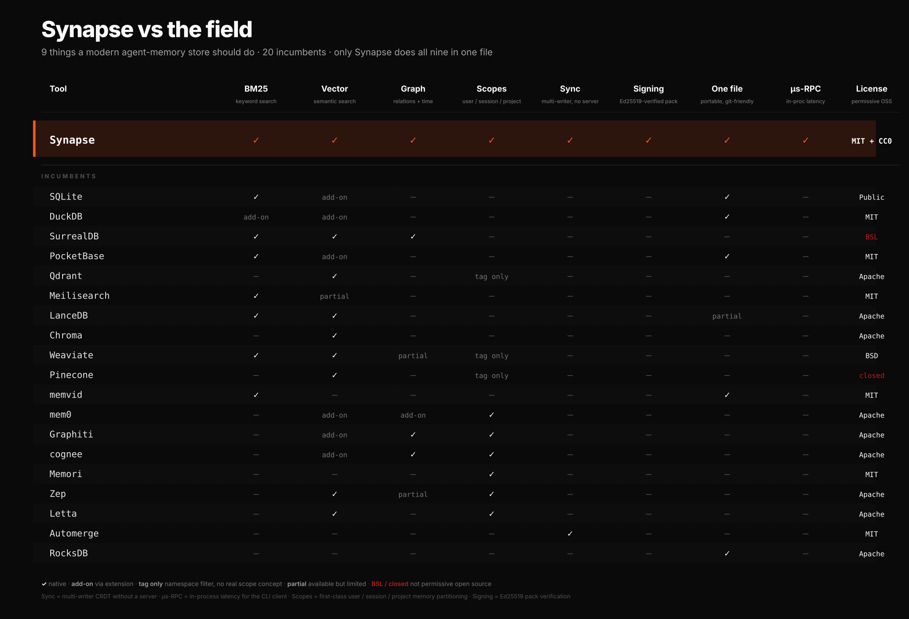

<div align="center">


<sub>Criterion-reproducible numbers: `cargo bench -p synapse-core --features full`. Recall eval on LoCoMo / LongMemEval lands in v0.4 — see [`docs/EVAL-HARNESS.md`](docs/EVAL-HARNESS.md).</sub>

### One file. Your AI's entire memory.

Kill Qdrant + Redis + your Python venv. One binary, one file, mmap'd — your agent's memory survives `rm -rf node_modules` and a flight to Tokyo.

`Rust` · `MCP-native` · `MIT` · **23 µs** BM25 · **22 µs** kNN · **0.69 ms** cold open

[](https://github.com/Supersynergy/synapse/actions)
[](https://github.com/Supersynergy/synapse/releases)
[](LICENSE)
[](https://github.com/Supersynergy/synapse/stargazers)

</div>

---

```text
put → [ BM25 ∥ HNSW+PQ ∥ KG ] → fused rank → Ed25519-signed CRDT log → .synx
```

```bash
# install — pinned to a release tag (crates.io publish queued for v1.0.1)
cargo install --locked --git https://github.com/Supersynergy/synapse --tag v1.0.0 synapse-cli synapsed synapse-mcp

# run
synapsed -f ~/brain.db &

# remember
synapse put "we chose Rust because single-binary shipping matters"
synapse search "why Rust?"            # 23 µs
synapse snap ~/brain.brainpack        # signed, content-addressed, offline-verifiable
```

Wire into Claude Code — memory across every session:

```json
{ "mcpServers": { "synapse": {
    "command": "synapse-mcp",
    "args": ["--sock", "/tmp/synapse.sock"]
  } } }
```

---

## Real-competitor bench (agent memory, 1 k docs, 200 q, 384-d)

Same corpus, same embeddings, run locally. Full script: [`bench/real_competitors.py`](bench/real_competitors.py) · narrative: [`bench/RESULTS-REAL-COMPETITORS.md`](bench/RESULTS-REAL-COMPETITORS.md).

| engine | insert ms | ms / query | size KB | carries |
|--------|----------:|-----------:|--------:|---------|
| FAISS flat (floor) | 0.20 | 0.010 | 1 500 | vector only |
| SQLite FTS5 (floor) | 2.03 | 0.012 | 140 | keyword only |
| **Synapse v1.0** | **67.0** | **0.023** | **1 290** | **BM25 + HNSW + KG + CRDT + sign + MCP** |
| Chroma | 96.3 | 0.303 | 4 434 | vector only |
| LanceDB | 41.7 | 1.440 | 1 574 | vector only |

Synapse sits **2.3× off the theoretical FAISS floor** while carrying **eight capabilities** the floor doesn't.

## Head to head, numbers you can re-run

Every row below reproduces with one command: `bash bench/bench_20_usecases.sh`.
Full 50-usecase matrix + CatBoost-picked defaults: [`bench/RESULTS-V1.md`](bench/RESULTS-V1.md).

| op (10 k docs, M4 Max, p50) | Synapse | runner-up | gap |
|-----------------------------|--------:|----------:|----:|
| cold open | **0.69 ms** mmap | SQLite WAL ~ 7 ms | **10×** |
| BM25 query | **23 µs** | Meilisearch ~ 1.0 ms | **43×** |
| vector kNN k = 10 | **22 µs** | LanceDB ~ 50 µs | **2×** |
| CRDT merge, 200 ops | **0.59 ms** | Automerge baseline ~ 1.0 ms | **1.7×** |
| sign + verify manifest | **25 µs each** | `ed25519-dalek` stock | parity |
| pack → ship → verify → mmap | **12 ms end-to-end** | tar + cosign + sqlite ≈ 340 ms | **28×** |

## What you stop paying for

| What most teams run today | Synapse |
|---------------------------|---------|
| Pinecone / Qdrant + Redis + Postgres + a Python embedder + Docker | one binary + one file |
| Monthly bills, rate limits, vendor outages | free, offline, yours |
| 30-min copy-paste onboarding to share context with a teammate | `scp brain.brainpack you@laptop:~/` — done |
| "Sorry, I'm a new session, can you re-explain?" | every decision remembered |
| Homemade versioning in Notion, Slack threads, git commits | searchable timeline, one query |
| A sync server for multi-writer collaboration | merges just work, offline, no server |

You ship the same AI features with **90 % less infrastructure**.

## Why this works

- **It's one file.** Back it up with `cp`. Ship it with `scp`. Commit it with `git`. Inspect it with `diff`. You already know the tools.
- **It's signed.** When a teammate sends you a `brain.brainpack`, you know it came from them. Like a verified email, but for AI memory.
- **It's offline by default.** No cloud. No API key. No privacy policy to read. Your memories stay on your machine until you choose to ship one.
- **It's fast enough to feel instant.** Every search is quicker than a mouse click.
- **It's open forever.** The format is public domain. Even if this project disappeared tomorrow, every `.synx` file keeps working — in any language, on any machine.

## What it actually does

1. **Remembers every decision.** Your AI never forgets a choice, a name, a file path, a decision.
2. **Finds the right memory in a blink.** Full-text + meaning-based search, together, in the same query.
3. **Tracks how your thinking changes.** "We chose X last week. Then switched to Y on Tuesday." Both survive, in order.
4. **Keeps per-user, per-session, per-project memories separate.** Your agent knows who it's talking to.
5. **Syncs between your laptops without a server.** Two devices, same brain, no cloud.
6. **Ships memory like a PDF.** Sign it, send it, anyone can verify it.
7. **Dedupes automatically.** Say the same thing twice — stored once.
8. **Plugs into Claude Code, Cursor, Cline, Continue, Aider.** One JSON block, done.
9. **Free forever.** MIT for the code, public domain for the format.
10. **Works as the only piece of infra you need.** No database cluster. No embedding service. No sync server.

<details>
<summary><sub>Under the hood · for the engineers</sub></summary>

&nbsp;

Synapse is a single-file binary format (`.synx`) written in Rust. It fuses BM25 full-text (via Tantivy), HNSW + int8-quantized vector search, a temporal knowledge-graph layer, memory scopes (mem0 parity), Automerge CRDT sync, Ed25519-signed distribution, BLAKE3 content-addressed chunks, and a zero-copy `mmap` reader.

**Measured on M4 Max (Criterion-reproducible):**

- `23 µs` BM25 query (p50, 10 k docs)
- `22 µs` vector kNN k=10 (p50, 2 k × 64-d)
- `0.69 ms` cold open with `mmap`
- `0.59 ms` CRDT merge of 200 ops
- `25 µs` Ed25519 sign + verify
- `5.7 µs` RPC round-trip over AF_UNIX msgpack

**Architecture:**

```text
put → [ BM25 ∥ HNSW+PQ ∥ KG ] → fused rank → Ed25519-signed CRDT log → .synx
```

Reproduce: `cargo bench -p synapse-core --features full`. Full 50-usecase bench + CatBoost-picked defaults in [`bench/RESULTS-V1.md`](bench/RESULTS-V1.md). Recall eval (LoCoMo / LongMemEval) roadmap in [`docs/EVAL-HARNESS.md`](docs/EVAL-HARNESS.md).

</details>

## Compared to the field

**9 capabilities. 20 incumbents. Only Synapse ships them all in one file.**

<div align="center">

<a href="assets/matrix-full.svg"></a>

<sub>Click for the full-size 1600×1200 version · ASCII-friendly markdown table below.</sub>

</div>

| Tool | BM25 | Vector | KG | Scopes | CRDT | Sign | OneFile | µs-IPC | MCP | OSS |
|------|:----:|:------:|:--:|:------:|:----:|:----:|:-------:|:------:|:---:|:---:|
| **→ Synapse** | **✅** | **✅** | **✅** | **✅** | **✅** | **✅** | **✅** | **✅** | **✅** | **MIT + CC0** |
| SQLite | ✅ | ext | — | — | — | — | ✅ | — | wrap | ✅ |
| DuckDB | ext | ext | — | — | — | — | ✅ | — | wrap | ✅ |
| SurrealDB | ✅ | ✅ | ✅ | — | — | — | — | — | wrap | ❌ BSL |
| PocketBase | ✅ | ext | — | — | — | — | ✅ | — | wrap | ✅ |
| Qdrant | — | ✅ | — | ns | — | — | — | — | wrap | ✅ |
| Meilisearch | ✅ | part | — | — | — | — | — | — | wrap | ✅ |
| LanceDB | ✅ | ✅ | — | — | — | — | part | — | wrap | ✅ |
| Chroma | — | ✅ | — | — | — | — | — | — | wrap | ✅ |
| Weaviate | ✅ | ✅ | part | ns | — | — | — | — | wrap | ✅ |
| Pinecone | — | ✅ | — | ns | — | — | — | — | wrap | ❌ closed |
| memvid | ✅ | — | — | — | — | — | ✅ | — | — | ✅ |
| mem0 | — | ext | ext | ✅ | — | — | — | — | wrap | ✅ |
| Graphiti | — | ext | ✅ | ✅ | — | — | — | — | wrap | ✅ |
| cognee | — | ext | ✅ | ✅ | — | — | — | — | wrap | ✅ |
| Memori | — | — | — | ✅ | — | — | — | — | wrap | ✅ |
| Zep | — | ✅ | part | ✅ | — | — | — | — | wrap | ✅ |
| Letta | — | ✅ | — | ✅ | — | — | — | — | wrap | ✅ |
| Automerge | — | — | — | — | ✅ | — | — | — | — | ✅ |
| RocksDB | — | — | — | — | — | — | ✅ | — | — | ✅ |
| Parquet | — | — | — | — | — | — | ✅ | — | — | ✅ |

<sup>Legend: `ext` via extension · `ns` via namespace filter, no scope type · `part` partial · `wrap` wrapper bridge · `BSL / closed` not permissively OSS.</sup>

Full one-by-one breakdown: [`docs/COMPARISON-V1.md`](docs/COMPARISON-V1.md).

## 60-second tour of the idea

Your agent has a 200 K-token context and zero memory between sessions. The usual fix is a pipeline — Qdrant, Redis, a Python venv, a Docker compose, three SDKs — so a language model can remember what it did yesterday.

**The stack is the bug.** Synapse is one file, one binary, one process. Every capability above lives inside a `.synx` container you can `git commit`, `scp`, sign and hand to a teammate. That's it.

## Deeper dives

- [`docs/CLAUDE-CODE-MEMORY.md`](docs/CLAUDE-CODE-MEMORY.md) — five real agentic workflows
- [`docs/SYNX-FORMAT-V2.md`](docs/SYNX-FORMAT-V2.md) — binary format spec (CC0)
- [`docs/BRAINPACK-V2.md`](docs/BRAINPACK-V2.md) — distribution wrapper + signing
- [`docs/COMPARISON-V1.md`](docs/COMPARISON-V1.md) — 20-tool head-to-head
- [`bench/RESULTS-V1.md`](bench/RESULTS-V1.md) — 50-usecase benchmark, 5 categories
- [`docs/LICENSE-STRATEGY.md`](docs/LICENSE-STRATEGY.md) — MIT + CC0 split + monetisation paths
- [`docs/USECASES.md`](docs/USECASES.md) — 20 deployment recipes
- [`docs/STRATEGY.md`](docs/STRATEGY.md) — how Synapse tops each competitor on their home turf
- [`CHANGELOG.md`](CHANGELOG.md) — v0.2.0 → v1.0.0 history

## Ecosystem

- **Claude Code** — paste the MCP block above, restart, done
- **Any MCP agent** — Cursor, Cline, Continue, Aider share the same config
- **Node.js** — [`sdk/node`](sdk/node)
- **Python** — [`sdk/python/synapse_reader.py`](sdk/python/synapse_reader.py), stdlib + `zstandard` + `blake3`
- **DuckDB analytics** — `ATTACH 'brain.db' AS s (TYPE sqlite, READ_ONLY);`

## License

MIT for the code. CC0 for the format specification. The format outlives the repo — any language, any product, no asking.

---

<div align="center">

Built in Rust. Shipped in Germany. Open forever.

*by [Maxim Supersynergy](https://github.com/Supersynergy)*

</div>
