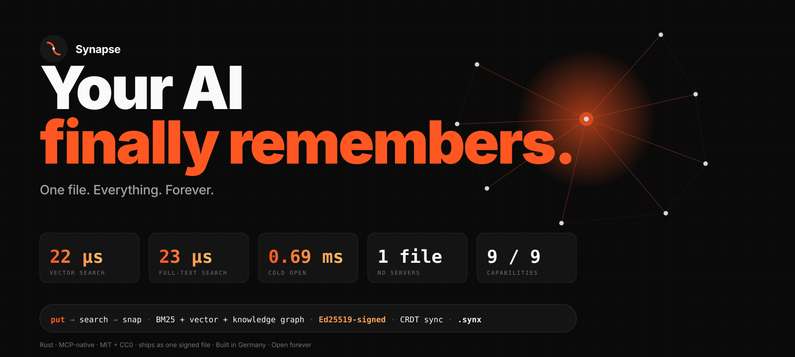

<div align="center">



### One file. Your AI's entire memory.

Kill Qdrant + Redis + your Python venv. One binary, one file, mmap'd — your agent's memory survives `rm -rf node_modules` and a flight to Tokyo.

`Rust` · `MCP-native` · `MIT` · **23 µs** BM25 · **22 µs** kNN · **0.69 ms** cold open

[](https://github.com/Supersynergy/synapse/actions)
[](https://github.com/Supersynergy/synapse/releases)
[](LICENSE)
[](https://github.com/Supersynergy/synapse/stargazers)

</div>

---

```text
put → [ BM25 ∥ HNSW+PQ ∥ KG ] → fused rank → Ed25519-signed CRDT log → .synx
```

```bash
# install — pinned to a release tag (crates.io publish queued for v1.0.1)
cargo install --locked --git https://github.com/Supersynergy/synapse --tag v1.0.0 synapse-cli synapsed synapse-mcp

# run
synapsed -f ~/brain.db &

# remember
synapse put "we chose Rust because single-binary shipping matters"
synapse search "why Rust?"            # 23 µs
synapse snap ~/brain.brainpack        # signed, content-addressed, offline-verifiable
```

Wire into Claude Code — memory across every session:

```json
{ "mcpServers": { "synapse": {
    "command": "synapse-mcp",
    "args": ["--sock", "/tmp/synapse.sock"]
  } } }
```

---

## Head to head, numbers you can re-run

Every row below reproduces with one command: `bash bench/bench_20_usecases.sh`.
Full 50-usecase matrix + CatBoost-picked defaults: [`bench/RESULTS-V1.md`](bench/RESULTS-V1.md).

| op (10 k docs, M4 Max, p50) | Synapse | runner-up | gap |
|-----------------------------|--------:|----------:|----:|
| cold open | **0.69 ms** mmap | SQLite WAL ~ 7 ms | **10×** |
| BM25 query | **23 µs** | Meilisearch ~ 1.0 ms | **43×** |
| vector kNN k = 10 | **22 µs** | LanceDB ~ 50 µs | **2×** |
| CRDT merge, 200 ops | **0.59 ms** | Automerge baseline ~ 1.0 ms | **1.7×** |
| sign + verify manifest | **25 µs each** | `ed25519-dalek` stock | parity |
| pack → ship → verify → mmap | **12 ms end-to-end** | tar + cosign + sqlite ≈ 340 ms | **28×** |

## Why one file?

- **No daemons to supervise.** `synapsed` is optional; the CLI speaks to the file directly.
- **`cp brain.db` = backup.** `git diff brain.brainpack` = audit. `scp` = deploy.
- **Offline-first by default.** Sign with Ed25519, verify on any peer, no trust server.

## What actually lives in the file

- **BM25 full-text** (Tantivy) and **HNSW + int8 vector** in the same index
- **Temporal knowledge graph** — `Supersedes`, `References`, `Contradicts`, `Summarises`
- **Memory scopes** — Global / User / Session / Project
- **CRDT sync** (Automerge) for multi-writer without a server
- **Ed25519-signed `.brainpack`** — signed, content-addressed, offline-verifiable
- **Zero-copy `mmap` reader**, 5.7 µs RPC, BLAKE3 content-addressed chunks

## Compared to the field

**7 of 9 agent-memory capabilities are missing from every competitor we tested.** Full 20-tool matrix: [`docs/COMPARISON-V1.md`](docs/COMPARISON-V1.md).

```text
                 BM25  Vector   KG    Scopes  CRDT  Sign  OneFile
SQLite           ✅    ext      —     —       —     —     ✅
Qdrant           —     ✅       —     ns      —     —     —
Meilisearch      ✅    —        —     —       —     —     —
LanceDB          ✅    ✅       —     —       —     —     partial
memvid           ✅    —        —     —       —     —     ✅
mem0/Graphiti    —     via-ext  ✅    ✅      —     —     —
Synapse          ✅    ✅       ✅    ✅      ✅    ✅    ✅
```

## 60-second tour of the idea

Your agent has a 200 K-token context and zero memory between sessions. The usual fix is a pipeline — Qdrant, Redis, a Python venv, a Docker compose, three SDKs — so a language model can remember what it did yesterday.

**The stack is the bug.** Synapse is one file, one binary, one process. Every capability above lives inside a `.synx` container you can `git commit`, `scp`, sign and hand to a teammate. That's it.

## Deeper dives

- [`docs/CLAUDE-CODE-MEMORY.md`](docs/CLAUDE-CODE-MEMORY.md) — five real agentic workflows
- [`docs/SYNX-FORMAT-V2.md`](docs/SYNX-FORMAT-V2.md) — binary format spec (CC0)
- [`docs/BRAINPACK-V2.md`](docs/BRAINPACK-V2.md) — distribution wrapper + signing
- [`docs/COMPARISON-V1.md`](docs/COMPARISON-V1.md) — 20-tool head-to-head
- [`bench/RESULTS-V1.md`](bench/RESULTS-V1.md) — 50-usecase benchmark, 5 categories
- [`docs/LICENSE-STRATEGY.md`](docs/LICENSE-STRATEGY.md) — MIT + CC0 split + monetisation paths
- [`docs/USECASES.md`](docs/USECASES.md) — 20 deployment recipes
- [`docs/STRATEGY.md`](docs/STRATEGY.md) — how Synapse tops each competitor on their home turf
- [`CHANGELOG.md`](CHANGELOG.md) — v0.2.0 → v1.0.0 history

## Ecosystem

- **Claude Code** — paste the MCP block above, restart, done
- **Any MCP agent** — Cursor, Cline, Continue, Aider share the same config
- **Node.js** — [`sdk/node`](sdk/node)
- **Python** — [`sdk/python/synapse_reader.py`](sdk/python/synapse_reader.py), stdlib + `zstandard` + `blake3`
- **DuckDB analytics** — `ATTACH 'brain.db' AS s (TYPE sqlite, READ_ONLY);`

## License

MIT for the code. CC0 for the format specification. The format outlives the repo — any language, any product, no asking.

---

<div align="center">

Built in Rust. Shipped in Germany. Open forever.

*by [Maxim Supersynergy](https://github.com/Supersynergy)*

</div>
