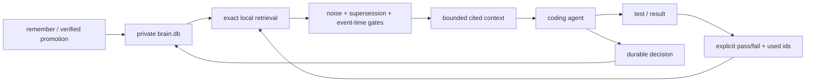

# Synapse Agent Memory feature boundary

The portable release focuses on one outcome: a person should be able to return to
their work with the important context intact.

## Included in every native download

| Human need | Command or surface | Release behavior |
|---|---|---|
| “Keep this decision.” | `remember`, `put` | Stores typed memory with a stable id, source, confidence, freshness, and bounded priority |
| “When did it happen?” | `remember --occurred-at`, temporal `context` queries | Separates capture time from event time; understands ISO, English/German relative dates, and quarters |
| “This replaces the old answer.” | `remember --supersedes <docs.id>` | Preserves history while excluding superseded truth from new context |
| “Find the useful part.” | `find`, `context --mode coding` | Exact lexical retrieval, hard context budget, dates, source ids, and filter diagnostics |
| “Help a new session understand this repo.” | `prime <repo>` | Combines project state, source documents, commands, and relevant memory |
| “Do not trust stale package assumptions.” | `fresh-context --no-registry` | Reads local manifests and lockfiles without external registry access |
| “That evidence helped—or failed.” | `feedback --gate pass\|fail --used`, `learn status` | Rejects unseen ids, records real use, and recalibrates scores and memory types locally |
| “Tell me whether my memory is healthy.” | `doctor`, `doctor --fix`, `db-verify`, `db-repair` | Classifies health; repair requires a restored, checked pre-repair brainpack and touches only FTS |
| “Let me carry and recover it.” | `backup`, `db-restore`, `snap`, `restore`, `merge` | Portable exchange, rollback, and CRDT merge |
| “Let me verify who signed this.” | `keygen`, `sign`, `verify` | BLAKE3 integrity and Ed25519 signatures |
| “Bring in what I already have.” | CSV, TSV, JSON(L), SQLite, brainpack | Typed import and export without a hosted service |
| “Connect related knowledge.” | relate, neighbors, traversal, PageRank, paths | Local graph basics with documented limits |
| “Share replicas deliberately.” | TCP federation; Unix sockets on Unix | Cross-platform CRDT federation without a central account |

Portable builds store memories without embeddings and say so once on write. They
do not treat missing vectors or a missing embedding cache as a health failure.

## Retrieval priority order

Synapse Agent Memory uses a bounded, evidence-first order:

1. Remove explicit transport/status noise and memories with a newer successor.
2. Apply event-time range when the query contains a date cue.
3. Normalize lexical score; apply learned calibration when evidence exists.
4. Add small type, confidence, and `critical|high|normal|low` bonuses.
5. Stop at the requested character budget and log the emitted candidates.

Priority never bypasses relevance. A high-priority unrelated document cannot beat
a clearly relevant result merely because its metadata says `critical`.

## Optional, separate adapter

The Codex checkpoint integration is a reversible Python adapter around the Rust
memory core. It records minimal execution state so an interrupted session can
recover carefully. It does not store transcript text, command arguments,
tool-output bodies, or file contents.

## Telepathy boundary

The historical Telepathy transcript tailer is not included. Live transport events
previously mixed useful continuity with status and notification noise. The release
keeps the human benefit through explicit memory, raw-corpus promotion, and the
minimal Codex checkpoint adapter. Context also suppresses known `[telepathy]`,
notification, stale, and archived records without deleting them.

Any future live transport must enter below the same noise, typing, provenance,
and promotion gates. Realtime arrival is not permission to become durable truth.

## Deliberately outside the portable download

| Surface | Reason it stays separate |
|---|---|
| MCP server and warm daemon | Current transports add platform and operational surface not needed for local memory |
| Semantic embedding runtime | Model distribution, first-run download, binary size, and platform linking need independent gates |
| Encrypted `age` packs and PDF ingest | Their dependency closures do not belong in the zero-warning minimal channel |
| ANN, Tantivy, sharding, and rerank research | Useful experiments, not required for daily agent continuity |
| Database, market, multimodal, CMS, and observability labs | Different products with different users and release contracts |
| Agent-vendor config mutation | Must remain reversible, documented, and opt-in |

## Memory loop

## Honest promise

Synapse Agent Memory is built for local coding-agent continuity: exact paths, errors,
decisions, temporal truth, compact cited context, offline operation, and careful
recovery. Self-healing means verified backup plus repair of rebuildable indexes;
it never means silently rewriting or deleting canonical memory. This release does
not claim automatic human-like memory, semantic recall without a model, multi-user
SaaS, or universal connector coverage.
