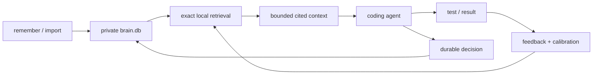

# Synapse Memory feature boundary

The portable release focuses on one outcome: a person should be able to return to
their work with the important context intact.

## Included in every native download

| Human need | Command or surface | Release behavior |
|---|---|---|
| “Keep this decision.” | `remember`, `put` | Stores typed memory with a stable id, source, freshness, and status metadata |
| “Find the useful part.” | `find`, `context --mode coding` | Exact lexical retrieval and bounded cited context |
| “Help a new session understand this repo.” | `prime <repo>` | Combines project state, source documents, commands, and relevant memory |
| “Do not trust stale package assumptions.” | `fresh-context --no-registry` | Reads local manifests and lockfiles without external registry access |
| “That evidence helped.” | `feedback`, `learn calibrate/status` | Records outcomes and tunes retrieval weights locally |
| “Tell me whether my memory is healthy.” | `doctor`, `db-verify`, `db-repair` | Checks integrity and offers explicit repair paths |
| “Let me carry and recover it.” | `backup`, `db-restore`, `snap`, `restore`, `merge` | Portable exchange, rollback, and CRDT merge |
| “Let me verify who signed this.” | `keygen`, `sign`, `verify` | BLAKE3 integrity and Ed25519 signatures |
| “Bring in what I already have.” | CSV, TSV, JSON(L), SQLite, brainpack | Typed import and export without a hosted service |
| “Connect related knowledge.” | relate, neighbors, traversal, PageRank, paths | Local graph basics with documented limits |
| “Share replicas deliberately.” | TCP federation; Unix sockets on Unix | Cross-platform CRDT federation without a central account |

Portable builds store memories without embeddings and say so once on write. They
do not treat missing vectors or a missing embedding cache as a health failure.

## Optional, separate adapter

The Codex checkpoint integration is a reversible Python adapter around the Rust
memory core. It records minimal execution state so an interrupted session can
recover carefully. It does not store transcript text, command arguments,
tool-output bodies, or file contents.

## Deliberately outside the portable download

| Surface | Reason it stays separate |
|---|---|
| MCP server and warm daemon | Current transports add platform and operational surface not needed for local memory |
| Semantic embedding runtime | Model distribution, first-run download, binary size, and platform linking need independent gates |
| Encrypted `age` packs and PDF ingest | Their dependency closures do not belong in the zero-warning minimal channel |
| ANN, Tantivy, sharding, and rerank research | Useful experiments, not required for daily agent continuity |
| Database, market, multimodal, CMS, and observability labs | Different products with different users and release contracts |
| Agent-vendor config mutation | Must remain reversible, documented, and opt-in |

## Memory loop

## Honest promise

Synapse Memory is built for local coding-agent continuity: exact paths, errors,
decisions, compact cited context, offline operation, and careful recovery. This
release does not claim automatic human-like memory, semantic recall without a
model, multi-user SaaS, or universal connector coverage.
